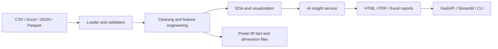

# Data Cleaning & Reporting Automation

An AI-ready Python 3.12 application that transforms raw CSV, Excel, JSON, and Parquet files into validated, cleaned datasets, interactive charts, executive reports, and Power BI-ready fact/dimension exports.

## What it delivers

- Automatic type inference, missing-value imputation, duplicate removal, optional fuzzy matching, and IQR/Z-score/Isolation Forest outlier handling.
- Deterministic data-quality checks with a transparent change log and quality score.
- Automated EDA: missing-value chart, correlation heatmap, and distribution charts.
- Professional HTML, Markdown, PDF, and Excel reports plus Power BI-ready star-schema CSV exports.
- Optional OpenAI Responses API executive summaries. When `OPENAI_API_KEY` is absent, the app remains fully functional with a deterministic local summary.
- Streamlit UI, FastAPI service with Swagger at `/docs`, Typer CLI, Docker, tests, linting, and GitHub Actions.

## Architecture



## Quick start

```bash
cp .env.example .env
uv sync --extra ai --extra quality --extra dev
uv run python main.py report data/sample/sales.csv
uv run uvicorn api.main:app --reload
# In another terminal
uv run streamlit run dashboard/streamlit_app.py
```

Open the API documentation at `http://localhost:8000/docs`. To enable AI-written insights, add an OpenAI API key to `.env`. The model is configurable through `OPENAI_MODEL`; it defaults to the requested `gpt-5.5` identifier.

## CLI

```bash
python main.py clean data/sample/sales.csv --strategy median
python main.py analyze data/sample/sales.csv
python main.py report data/sample/sales.csv
python main.py dashboard
```

## API

| Endpoint | Purpose |
| --- | --- |
| `POST /upload` | Upload a supported dataset |
| `POST /clean` | Run the end-to-end pipeline with cleaning options |
| `POST /analyze` | Profile, clean, and return insights |
| `POST /report` | Generate all report assets |
| `GET /download/{job_id}/{format}` | Download a generated asset |

## Outputs

`data/cleaned/` contains cleaned CSV files. `reports/html`, `reports/pdf`, and `reports/excel` hold the executive outputs. `reports/power_bi/` contains `fact_data.csv` and one dimension CSV per categorical column.

## Screenshots

Dashboard preview: run the Streamlit command above and upload `data/sample/sales.csv`.

## Development

```bash
make lint
make test
docker compose up --build
```

The test suite is configured to enforce 90% source coverage in CI. Expand the suite alongside new modules before changing the threshold.

## Roadmap

- Add persisted job storage and async workers for large files.
- Add Great Expectations suites and configurable Pandera schemas per data domain.
- Add LangGraph agent routing, RAG-backed metric definitions, and an MCP tool server when external business context is available.
